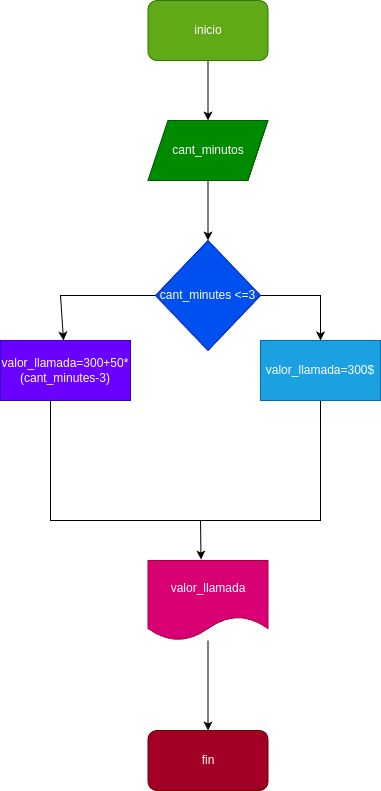

# Condicionales_1
condicionales #1
## Costo de una llamada telefonica

# Programa #1
ingresar el tiempo de duracion  de una llamada telefonica y determinar la cantidad a pagar de acuerdo con lo siguiente:

_ Todas llamada que dure 3 minutos o menos tiene un costo de 300$

_cada minuto adicional cuesta 50$

# Analisis

## import
### varibles de entrada
cant_minutos: cantidad de mintos en la llamada 
# Processing
valor_llamada: cualquier valor de la llamamda 

si es menor a 3 minutos: El vaofinal cera de 300 pesos

si es mayor a 3 minutos: El valor final sera 50 pesos

### output
costo de la llamada 
# Diseño

# Construccion
